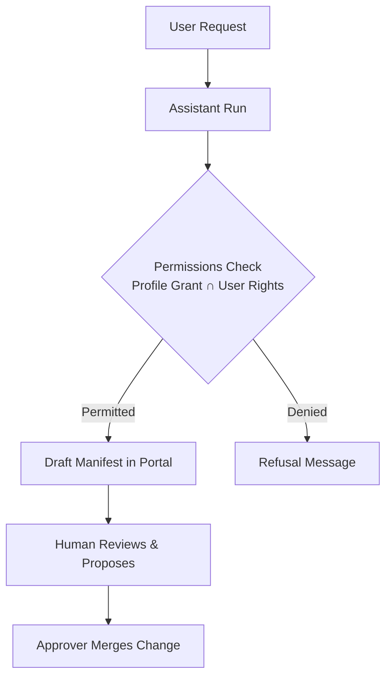

# Collaborating with Autonomous AI Agents

The Portal treats AI agents as team members governed by the principle of least privilege. You can converse with the assistant from any screen, launch background agent work runs, inspect runtime permissions, and connect external AI clients over the Model Context Protocol (MCP). Every change prepared by an agent lands as a draft that requires human review and approver sign-off.



## 1. Using the Docked Assistant

The assistant is accessible from every page through a persistent button fixed at the bottom right corner of the screen.

### Asking Questions and Driving Portal Navigation

#### By hand

1. Click **Open the assistant** in the bottom right corner of any page.
2. In the text area labelled **Tell the assistant what to build or change…**, type your query, such as asking about platform activity.
3. Press Enter or click **Send**.
4. Use the dock header controls to manage the conversation:
   - Click **Stop the assistant** to interrupt an active response.
   - Click **Full screen** to expand the conversation view across the workspace.
   - Click **Hide the assistant** to fold the panel into the bubble while preserving conversation context.
   - Click **Close the assistant** to release the active dialogue.
You should see the assistant stream tool invocations, answer your questions, and navigate to target forms with pre-filled drafts.

The live journeys `assistant-reads.spec.ts` and `assistant-creates.spec.ts` replay these steps.

#### By asking the assistant

Type into the composer: `Create a context space called air-quality in the helsinki project`. The assistant switches routes to `/projects/helsinki/spaces`, opens the **New Context Space** dialog, and populates the name and model fields. You run the validation check and click **Propose change** yourself.

## 2. Launching Unattended Agent Work

From the dedicated Assistant workbench, you can launch autonomous runs that generate applications, dashboards, or data analyses without step-by-step interview prompts.

### Starting a Background Work Run

#### By hand

1. In the sidebar navigation, click **Assistant** to open `/projects/helsinki/assistant`.
2. Scroll down to the **New work** card.
3. In **What to make**, choose `Application`, `Dashboard`, or `Analysis`.
4. In **Name**, enter `bikes-summary`.
5. In **Endpoint**, select a published data view, such as `helsinki-bikes`.
6. In **What should it do?**, describe the expected layout and metrics, such as `Show total available bikes and station capacity`.
7. Click **Start**.
You should see the run appear in the table with its current phase, displaying elapsed execution time and continuation options once completed.

The live journey `build-samples.spec.ts` replays these steps.

#### By asking the assistant

Type into the composer: `Build an application called bikes-summary from the helsinki-bikes endpoint showing total available bikes`. The assistant initiates the run and provides a direct link to open the execution view.

## 3. Reviewing and Editing Agent Access

An agent profile defines the outer boundary of operations an agent may reach. Runtime access is always calculated as the strict intersection of the profile grant and your personal permissions.

### Inspecting Profile Capabilities

#### By hand

1. Open `/projects/helsinki/assistant` and scroll to the **Agent access** section.
2. Select a profile card, such as `app-builder`.
You should see a table listing operations, indicating whether the profile grants each capability, whether your user account possesses it, and any applicable restriction reasons.
3. Click **Edit access** to open the access configuration editor.
4. Update the YAML specification under **Access block (YAML)** to add or remove permitted operations.
5. Click **Propose change** to submit the modification as a proposal in Approvals.

#### By asking the assistant

The assistant cannot widen its own permissions or alter its assigned profile directly. You must inspect and update profile grants by hand in the Portal.

## 4. Connecting External Agents via MCP

Published endpoints provide Streamable HTTP endpoints implementing the Model Context Protocol, enabling external agents like Claude Code or OpenHands to query context data.

### Configuring an External Agent Connection

#### By hand

1. Open `/projects/helsinki/endpoints` and select an endpoint with the `mcp` representation enabled, such as `helsinki-all`.
2. Locate the public URL and copy the MCP address: `https://portal.joinedcontext.com/api/endpoint/mluyob4nz52lok3ssk7pgn5vwt/mcp`.
3. In your local MCP client configuration, add the server entry:

   ```json
   {
     "mcpServers": {
       "helsinki-context": {
         "url": "https://portal.joinedcontext.com/api/endpoint/mluyob4nz52lok3ssk7pgn5vwt/mcp"
       }
     }
   }
   ```

4. Connect your client. A public endpoint answers the tool list and every read with no sign-in at all. An endpoint published to the organization or to selected projects refuses an anonymous call and tells the client where to sign in, so your client runs that sign-in once and comes back with a token that is good for this one endpoint.
You should see your external agent discover available data inspection tools and execute queries conforming to the endpoint policy.

#### By asking the assistant

Type into the composer: `What is the MCP address for the helsinki-all endpoint?`. The assistant inspects the endpoint manifest and returns the complete Streamable HTTP URL ready to paste into your external client configuration.

## Related

- [07-users-roles-approvals.md](./07-users-roles-approvals.md): reviewing merge proposals and managing user access.
- [11-apps.md](./11-apps.md): supervising application builder agents and evaluating previews.
- [10-role-guides.md](./10-role-guides.md): role-specific workflows and platform navigation cheat sheets.
