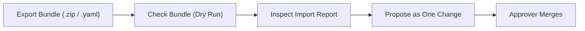

# Export, Portability & Project Duplication

All platform configurations can be exported, cloned, imported, or synchronized with external repositories. Every imported resource compiles into a reviewable change proposal in Approvals, ensuring that foreign configurations never overwrite local state without review.

## 1. Exporting a Project or Resource

You can package an entire project or an individual manifest into portable archive formats.

### Downloading a Configuration Archive

#### By hand

1. Open `/projects/helsinki/endpoints` or any resource view in the project.
2. In the row menu or page header, click **Export**.
3. In the dialog titled **Download configuration**, choose the target **Format**:
   - **Whole project (configuration, schemas and data models)** for a complete ZIP archive including schemas and documentation.
   - **YAML** for multi-document manifest streams.
   - **JSON list** for structured manifest objects.
   - **ZIP archive** for manifests, native files, and an index.
4. Select the desired **Revision** (Current is selected by default).
5. Click **Download**.
You should see your browser download the package containing manifests, LinkML schemas, and pipeline configurations.

#### By asking the assistant

Type into the assistant composer: `Export the helsinki project as a ZIP archive`. The assistant opens the export dialog with the whole project format selected for confirmation.

## 2. Importing Configuration Bundles

You can restore an exported archive or load manifests into an existing project.

### Loading an External Bundle

#### By hand

1. In the sidebar navigation, click **Import** to navigate to `/projects/helsinki/import`.
2. Under **Archive or manifests**, click browse and select a `.zip`, `.yaml`, or `.json` file.
3. In **Project to import into**, confirm `helsinki`. Every imported manifest is rewritten into it.
4. In **Organisation domain**, enter `hel.fi` or leave blank to use the instance default.
5. In **A resource this project already has**, choose collision behavior:
   - **Stop the import**: stops if any named resource already exists.
   - **Leave ours alone**: skips existing resources and imports remaining ones.
   - **Replace ours**: overwrites existing manifests with bundle versions.
   - **Import under a new name**: renames conflicting incoming manifests.
6. Click **Check the bundle** to execute a dry run.
You should see the report titled **What this import would do**, summarizing created, replaced, skipped, and renamed files alongside required credentials.
7. Click **Propose the import**.
8. Navigate to `/projects/helsinki/approvals` and approve the proposed change.

#### By asking the assistant

The assistant cannot read local files from your computer without browser file selection. Upload the bundle on `/projects/helsinki/import` or attach a text sample directly to the composer drop zone.

## 3. Keeping in Sync with External Sources

A SyncSource keeps your project in step with an upstream: a repository, a published bundle, or another instance's API.

### Adding an Upstream Synchronization Source

#### By hand

1. In the sidebar navigation, click **Sync** to open `/projects/helsinki/syncsources`.
2. In the header origin selector, select **A Git repository**, **A published bundle**, or **Another instance's API**.
3. Click **Add source**.
4. In the dialog, set **Name** to `regional-models-sync`, **Clone URL** to `https://git.example.org/models.git`, and **Run every** to `6h`.
5. Set **Mode** to `mirror` and **When a resource already exists** to `fail`.
6. Click **Propose the source**.
7. An approver merges the proposal in Approvals.
8. Once applied, the card displays observed revision and sync state. Click **Sync now** to trigger an immediate pull, **Pause** to hold syncs, or **Detach** to remove the SyncSource while keeping imported resources.

#### By asking the assistant

Type into the assistant composer: `Add a git sync source called regional-models-sync reading https://git.example.org/models.git every 6h`. The assistant opens the form on `/projects/helsinki/syncsources` with values populated for review.

## 4. Publishing Open Data to CKAN

Public endpoints can be published directly to an open-data portal using native DCAT-AP metadata.

### Registering a Catalogue and Publishing Datasets

#### By hand

1. Navigate to `/projects/helsinki/ckan`.
2. Under **Catalogues**, enter **Name** as `helsinki-ckan`, **URL** as `https://data.example.org`, and **Default organization** as `helsinki-region-context`.
3. In **API token secret**, enter the name of the secret holding your credentials, such as `ckan-token`.
4. Click **Propose catalogue**.
5. Once merged, open `/projects/helsinki/endpoints` and edit your public endpoint, such as `helsinki-bikes`.
6. In the endpoint configuration, select `helsinki-ckan` as the target open-data catalogue.
You should see the dataset listed under Published endpoints with direct links to DCAT-AP records and DataStore mirrors.

#### By asking the assistant

Type into the assistant composer: `Publish the helsinki-bikes endpoint to the open data catalogue`. The assistant opens the endpoint configuration dialog with catalogue fields pre-filled.

## Related

- [02-organizations-projects-spaces.md](./02-organizations-projects-spaces.md): projects, context spaces and the boundaries between them.
- [07-users-roles-approvals.md](./07-users-roles-approvals.md): reviewing proposals and resolving configuration drift.
- [10-role-guides.md](./10-role-guides.md): role-specific checklists for administrators and stewards.
