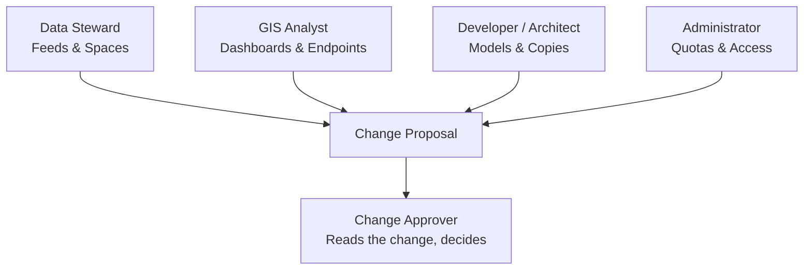

# Role Guides & Daily Workflows

This chapter provides day-to-day operational workflows tailored to specific organizational responsibilities. In the Portal, every role operates through governed change channels: you draft or modify configurations, validate them against strict schemas, propose changes, and an approver merges them before deployment.

## 1. Data Steward Workflow

Data stewards connect sensor feeds, manage data sources, operate ingestion pipelines, and monitor normalized entity health.

### Connecting a Feed and Checking Entity Arrival

#### By hand

1. Open `/projects/helsinki/datasources` and click **New data source**.
2. Select type `http`, enter name `hsl-bikes-status`, and provide feed URL `https://gbfs.theta.fifteen.eu/gbfs/2.2/helsinki/en/free_bike_status.json`.
3. Click **Check** to inspect planned changes and test a single probe fetch.
4. Click **Propose change**.
5. Once merged, open `/projects/helsinki/pipelines`, click **New pipeline**, select `hsl-bikes-status` as source, and provide transformation mapping.
6. Click **Test mapping** to verify entity normalization, then click **Propose change**.
7. Open `/projects/helsinki/explore`, select Context Space `helsinki` and type `Vehicle`, and verify incoming entities.
You should see live entity records populate the grid with timestamps and geographic coordinates.

The live journey `load.spec.ts` replays these steps.

#### By asking the assistant

Type into the assistant composer: `Is the citybikes-gbfs pipeline running?`. The assistant inspects pipeline metrics and reports message throughput, latency, and error counts.

## 2. GIS Analyst and Data Consumer Workflow

Analysts visualize municipal data on geospatial canvases, filter entity distributions, and export data feeds into external tools like QGIS or Excel.

### Building a Dashboard and Sharing an Endpoint

#### By hand

1. Open `/projects/helsinki/dashboards` and click **New dashboard**.
2. Enter title `City Bikes Map`, then click **New layer**.
3. Select the **Endpoint** `helsinki-bikes`, choose **Style** `circle`, and set **Colour by** to `availableBikeNumber`.
4. Click **Propose change** to submit the dashboard for approval.
5. Open `/projects/helsinki/explore` to read the live records, and narrow them to an area by drawing a box on the map.
6. Open `/projects/helsinki/endpoints` to locate endpoint `helsinki-bikes`, copy the GeoJSON link, and paste it into QGIS.
You should see vector points render on your map canvas reflecting current bike availability across Helsinki.

The live journey `share.spec.ts` replays these steps.

#### By asking the assistant

Type into the composer: `Make a dashboard called city-bikes-map showing the bikes of the helsinki space`. The assistant prepares the dashboard and layer definitions for your review.

## 3. Change Approver Workflow

Approvers read what a change would do, decide it, and keep the project from drifting away from what it declares.

### Reviewing and Deciding Proposals

#### By hand

1. Open `/projects/helsinki/approvals` to review pending proposals.
2. Filter the queue by selecting `Only mine` or filtering by phase.
3. Click a proposal title to open the detail view at `/projects/helsinki/approvals/chg-a1b2c3d4`.
4. Read the table of changes: every **Field** with its **Change type** and its value **Before** and **After**.
5. For a red-lane change, type the resource name into **Resource name confirmation**.
6. Click **Approve** to merge and apply the change, or click **Reject** with an explanation.
You should see the phase chip reach Applied, which is the platform saying the change is live.

The live journeys `roles-refusals.spec.ts` and `one-change-at-a-time.spec.ts` replay these steps.

#### By asking the assistant

Type into the composer: `What waits for approval in helsinki?`. The assistant lists pending changes, their authors, and risk classes. The approval decision must be made by clicking **Approve** in the Portal.

## 4. Data Architect and Developer Workflow

Architects define LinkML data models, configure model-to-model mappings, instantiate blueprints, and isolate changes using project copies.

### Evolving Schemas and Working in Isolated Copies

#### By hand

1. Open `/projects/helsinki/models` to author classes and attributes using visual and YAML source editors.
2. In the Smart Data Models catalogue, search for standard schemas and adapt them to local municipal needs.
3. Switch to the **Mappings** tab to configure transformations between schemas with automated golden tests.
4. To test breaking updates safely, open `/projects/helsinki/workspaces` and click **Work on a copy**.
5. Enter the copy name `dev-experiment`, make your changes inside the copy, and try its endpoints on the copy's own **Try it** page.
6. Open `/projects/helsinki/workspaces/dev-experiment/bring-back` and click **Propose as one change**, which brings everything the copy changed back as one change.
You should see everything the copy changed gathered into one proposal in Approvals.

The live journey `copy-employee.spec.ts` replays these steps.

#### By asking the assistant

Type into the composer: `Work on a copy of the helsinki project called dev-experiment, and in that copy pause the hel-news pipeline`. The assistant starts the copy and makes the change inside it, then stops: bringing the copy back, or discarding it, is yours.

## 5. Platform Administrator Workflow

Administrators set the boundaries of the organization, watch what the platform is doing, keep an eye on quotas, and decide who may do what.

### Monitoring Health and Assigning Access

#### By hand

1. Open `/projects/helsinki/spaces` and inspect the **Project Quota** card to check usage of Context Spaces, resident pipelines, and public endpoints against hard limits.
2. Navigate to `/projects/helsinki/access` to grant roles to team members or synchronize organizational groups.
3. Monitor system events and gateway decisions on `/projects/helsinki/activity`, inspecting live tail events for rejected calls or pipeline restarts.
You should see live log entries and throughput statistics update without manual page reloads.

The live journey `walk.spec.ts` replays these steps across every project page.

#### By asking the assistant

Type into the composer: `Show activity warnings in the helsinki project from the last hour`. The assistant filters the activity feed and summarizes recent operational alerts.

## Related

- [01-getting-started.md](./01-getting-started.md): continuous walkthrough from login to published endpoint.
- [07-users-roles-approvals.md](./07-users-roles-approvals.md): managing permissions, service accounts, and approvals.
- [08-working-with-ai-agents.md](./08-working-with-ai-agents.md): collaborating with autonomous agents via MCP.
