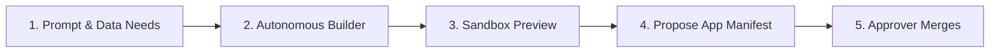

# Apps on Demand

Applications on demand are lightweight, purpose-built web tools generated by an AI builder agent to fulfill specific operational workflows. You choose an existing data endpoint, describe what the application should display, and the builder scaffolds, tests, and serves a preview. Every generated application is private to authenticated team members and requires approver sign-off before production deployment.

## 1. Generating an Application

You create applications from published endpoints, defining a strict perimeter of types and attributes the application may read.

### Requesting an Application

#### By hand

1. In the sidebar navigation, click **Applications** to open `/projects/helsinki/apps`.
2. Click **Generate your own app**.
3. Under **Endpoint**, select the source data feed, such as `Helsinki city news` or `helsinki-bikes`.
4. In **What should the app do?**, enter a plain description, such as: `A table of the latest city news: the headline and when it was published.`
5. Click **Details: name, kind, and what it may read ({name})** to expand configuration options:
   - In **App name**, enter a unique identifier, such as `news-feed-summary`.
   - In **Kind**, choose `Full stack (Rust backend and React screens)`, `Static (screens only)`, or `Service (backend only, no screens)`.
   - Under **What the app will be allowed to read**, review the attribute checklist derived from the endpoint, unticking attributes the application does not require.
6. Click **Generate the app**.
You should see the Portal open the run view at `/projects/helsinki/apps/news-feed-summary` tracking build phases.

The live journey `build-samples.spec.ts` replays these steps.

#### By asking the assistant

Type into the assistant composer: `Build a static application called news-feed-summary from the helsinki-news endpoint displaying headlines and publication dates`. The assistant opens the application builder with the prompt, endpoint, and name pre-filled for your review.

## 2. Supervising the Builder and Clarifying Architecture

During generation, the builder advances through defined lifecycle phases: Queued, Starting the workspace, Asking questions, Building, and Testing.

### Answering Questionnaires

#### By hand

1. On the application run page `/projects/helsinki/apps/news-feed-summary`, follow the live timeline.
2. If the builder requires clarification regarding layouts, color palettes, or aggregation windows, an interactive question form appears in the conversation feed.
3. Select your preferred options and click **Send**.
4. If compilation or automated tests fail, the builder inspects compiler diagnostics and attempts automated code repairs.
You should see status advance to **Preview ready** once code compilation and test suites pass.

#### By asking the assistant

Type into the composer: `What is the current status of the news-feed-summary build?`. The assistant inspects the run timeline and reports current phase and token usage.

## 3. Previewing in the Sandbox

Before proposing an application for production use, you interact with it in an isolated sandbox frame.

### Evaluating Application Behavior

#### By hand

1. When the run status reaches **Preview ready**, an iframe renders the application canvas directly on the run page.
2. Test filters, sorting controls, and map layers inside the frame.
3. Verify that data records display properly without exposing unselected attributes.
4. If adjustments are required, type instructions into the conversation input and click **Send** to trigger a rebuild.
You should see the preview iframe update automatically to display your requested refinements.

#### By asking the assistant

Type into the composer: `Open the preview for news-feed-summary`. The assistant provides the preview URL and displays it in the workspace view.

## 4. Publishing and Retiring Applications

Deploying an application to production generates a declarative `App` manifest that follows the standard change review flow.

### Publishing the Application

#### By hand

1. On the run page, click **Publish this app**.
2. In the confirmation dialog, review the target visibility (`Visible to project` or `Visible to organization`).
3. Click **Open the merge request** to submit the `App` manifest to Approvals.
4. An approver opens `/projects/helsinki/approvals`, reviews the manifest diff, and clicks **Approve**.
5. Once merged, the application is live at `/apps/news-feed-summary/` behind platform authentication.
6. To retire an application, open `/projects/helsinki/apps`, locate the application card, click **Delete**, confirm the name, and click **Propose removal**.

#### By asking the assistant

Type into the composer: `Propose publication for the news-feed-summary application`. The assistant prepares the change proposal for approver adjudication.

## 5. Application or Dashboard?

When visualizing municipal data on screen, choose between an Application and a Dashboard based on workflow needs:

- Use a Dashboard on `/projects/helsinki/dashboards` when you need standing map layers, a chart over time or a grid, with nothing to generate and nothing to build.
- Use **Generate your own app** on `/projects/helsinki/apps` when you need an interaction a dashboard does not have: a map beside your own tables, cards of numbers, a download the reader triggers, or a form that edits a record.

## Related

- [05-endpoints-and-sharing.md](./05-endpoints-and-sharing.md): publishing and securing multi-representation endpoints.
- [06-dashboards.md](./06-dashboards.md): configuring map layers and operational dashboards.
- [08-working-with-ai-agents.md](./08-working-with-ai-agents.md): supervising autonomous agents and setting permissions.
